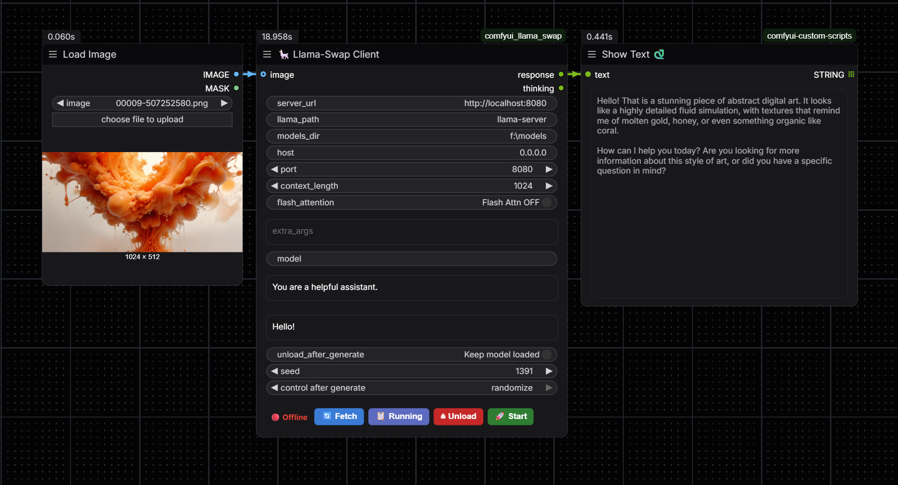

# 🦙 ComfyUI LlamaSuite
> All-in-one solution for llama.cpp in ComfyUI.
> Launch, manage, and run inference with llama.cpp (llama-server) directly from your ComfyUI workflow — no external terminal required.



---

✨ Features
| Feature	| Description | 
|---|---|
| 🚀 Integrated Server Manager	| Start/Stop llama-server directly from the node UI. Supports custom paths, ports, models dirs, and extra args. |
| 🔄 Live Model Picker	| Fetches /v1/models from your running server and shows a floating dropdown — click to set. |
| 🖼️ Vision Support	| Connect any ComfyUI IMAGE node; the first frame is base64-encoded and sent as image_url for vision models. |
| 🧠 Thinking Extraction	| <think> / <thinking> blocks are stripped from response and surfaced in a separate thinking output. |
| ⏏️ Auto-Unload | Toggle	Calls /models/unload automatically after every generation — great for VRAM-constrained setups. |
| 📋 Status Monitoring	| Real-time connection status badge (Online/Offline) and a "Running" button to check loaded models. |
| 🔌 Proxy Routes	| Built-in CORS-free proxy routes for seamless communication between ComfyUI frontend and llama.cpp backend. |

---

🗂️ Nodes
🦙 LlamaSuite Client
The main inference and management node.

⚙️ Server Configuration
| Input	| Type | Description |
|---|---|---|
| llama_path |	STRING |	Path to llama-server executable (e.g., llama-server.exe or ./llama-server). | 
| models_dir |	STRING |	Path to directory containing GGUF models. | 
| host |	STRING  |	Host to bind to (default: 0.0.0.0). | 
| port |	INT |	Port for the server (default: 8080). | 
| context_length |	INT	Context window size (default: 8192). | 
| flash_attention |	BOOLEAN |	Enable Flash Attention (-fa on). | 
| extra_args |	STRING |	Additional CLI arguments (e.g., -ngl 99). | 

---

🧠 Inference Settings
| Input	| Type | Description |
|---|---|---|
| server_url	| STRING	| Base URL for API calls (auto-updates with port). |
| model	| STRING	| Model ID — populated via 🔄 Fetch Models. |
| system_prompt	| STRING	| System role message. |
| prompt	| STRING	| User message / question. |
| unload_after_generate	| BOOLEAN	| Auto-unload model from VRAM after generation. |
| seed	| INT	| Random seed for reproducibility. |
| image (optional)	| IMAGE	| Input image for vision models. |

---

📤 Outputs
| Output	| Description |
|---|---|
| response	| Clean human-readable text (<think> blocks removed). |
| thinking	| Extracted reasoning chain (empty if none). |

---

## ⚡ Installation

## 1. Install ComfyUI Custom Node

```bash
cd ComfyUI/custom_nodes
git clone https://github.com/YOUR_USERNAME/LlamaSuite.git
```

## 2. Install llama.cpp

1. Go to llama.cpp Releases.
2. Download the latest llama-bins-<version>.zip for Windows (or build from source for Linux/macOS).
3. Extract the zip file.
4. 🔥 CRITICAL STEP: During extraction or setup, ensure you add llama.cpp/build/bin (or the folder containing llama-server.exe) to your system PATH.
  This allows you to type llama-server anywhere in your command line without specifying the full path.
  Alternative: If you don't add it to PATH, you must provide the full absolute path to llama-server.exe in the llama_path field of the node (e.g.,     C:\Users\You\llama.cpp\build\bin\llama-server.exe).

> **Dependencies**: requests and pillow (usually pre-installed).
aiohttp is required for backend routing (will be installed via pip install -r requirements.txt if missing).

Restart ComfyUI after cloning.

---

## 🚀 Quick Start

1. Add a **🦙 Llama-Swap Client** node
2. Set `server_url` to your llama-swap address
3. Click **🔄 Fetch Models** → select a model from the dropdown
4. Connect a **Preview Text** node to `response`
5. *(Optional)* Connect a second **Preview Text** node to `thinking` to debug reasoning chains
6. Hit **Run** 🎉

---

## 🧠 Thinking Output

Models like **DeepSeek-R1**, **QwQ**, **Qwen3** and other reasoning models wrap their chain-of-thought in `<think>` tags.  
This node automatically separates them:

```
response  →  The final clean answer (ready for downstream nodes like LLM Router or Save Text)
thinking  →  The full internal reasoning trace (for debugging or logging)
```

Both `<think>` and `<thinking>` variants are handled.

---

## 🔌 Backend Routes

The extension registers lightweight proxy routes on ComfyUI's `PromptServer` to avoid CORS issues and simplify frontend requests:

| Route	| Method	| Proxies to |
|---|---|---|
| `/llama_suite/models` | GET | `GET {url}/v1/models` |
| `llama_suite/running` | GET | `GET {url}/running` |
| `/llama_suite/unload` | POST | `POST {url}/models/unload` |
| `/llama_suite/start` | POST | `Local: Starts llama-server process` |
| `/llama_suite/stop` | POST | `Local: Kills llama-server process` |

---

## 📄 License

MIT
